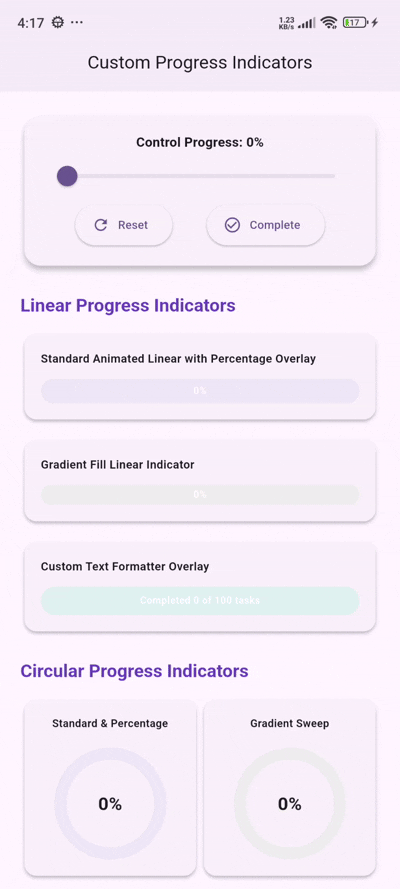

# flutter_custom_progress_indicator

[](https://flutter.dev)
[](https://opensource.org/licenses/MIT)
[](#)

**flutter_custom_progress_indicator** is a premium, highly customizable, and interactive progress indicator library for Flutter. It features smooth animated circular and linear progress indicators, custom `CustomPainter` arc rendering, vibrant gradient fills, percentage text overlays, custom value formatters, and center child widget integration.

---

## 📷 Preview

<p align="center">
  
</p>

*A premium interactive circular and linear progress indicator package featuring smooth progress animations, gradient support, custom text formatting, and widget overlays.*

---

## ✨ Features

- **⭕ Custom Circular Progress Indicator**
  - High-performance `CustomPainter` implementation supporting customizable stroke caps (`StrokeCap.round`, `StrokeCap.butt`), stroke width, track background color, and smooth arc rendering.
- **📏 Custom Linear Progress Indicator**
  - Smooth animated linear progress bar with customizable height, width, rounded corners (`BorderRadius`), and track styling.
- **🎨 Gradient & Solid Color Fills**
  - Fully supports custom `Gradient` shaders (`SweepGradient`, `LinearGradient`, etc.) as well as solid progress colors.
- **⚡ Smooth Implicit Animations**
  - Driven by built-in `TweenAnimationBuilder` with configurable `animationDuration` and `animationCurve` for fluid UI transitions.
- **🔢 Percentage & Custom Text Formatting**
  - Display centered progress percentage text overlays with custom `percentageTextStyle` and dynamic `valueFormatter` functions.
- **🧩 Central Child Overlays**
  - Place any custom Flutter widget (icons, badges, images, stacked text) directly inside the center of circular or linear indicators.

---

## 📦 Installation

To use this library in your Flutter project, add it to your `pubspec.yaml` dependencies:

```yaml
dependencies:
  flutter:
    sdk: flutter
  # From pub.dev
  flutter_custom_progress_indicator: ^0.0.1
```

Or reference it directly from a Git repository:

```yaml
dependencies:
  flutter_custom_progress_indicator:
    git:
      url: https://github.com/your_username/flutter_custom_progress_indicator.git
      ref: main
```

---

## 🚀 Usage

Import the package in your Dart code:

```dart
import 'package:flutter_custom_progress_indicator/flutter_custom_progress_indicator.dart';
```

### 1. Simple Animated Circular Indicator
Create a circular progress indicator with animated progress changes and percentage text overlay.

```dart
CustomCircularProgressIndicator(
  progress: 0.75,
  size: 120,
  strokeWidth: 12,
  progressColor: Colors.deepPurple,
  backgroundColor: Colors.deepPurple.shade100,
  showPercentage: true,
)
```

### 2. Circular Indicator with Gradient & Central Widget
Combine vibrant gradient shaders with custom child widgets placed directly in the center.

```dart
CustomCircularProgressIndicator(
  progress: 0.85,
  size: 140,
  strokeWidth: 14,
  strokeCap: StrokeCap.round,
  gradient: const SweepGradient(
    colors: [Colors.blue, Colors.purple, Colors.pink],
  ),
  child: const Column(
    mainAxisAlignment: MainAxisAlignment.center,
    children: [
      Icon(Icons.bolt, color: Colors.amber, size: 32),
      Text('85%', style: TextStyle(fontWeight: FontWeight.bold)),
    ],
  ),
)
```

### 3. Linear Progress Bar with Custom Gradient & Text Overlay
A sleek linear progress bar with rounded corners and centered text overlay.

```dart
CustomLinearProgressIndicator(
  progress: 0.65,
  height: 24,
  borderRadius: BorderRadius.circular(12),
  gradient: const LinearGradient(
    colors: [Colors.cyan, Colors.blue],
  ),
  showPercentage: true,
)
```

### 4. Custom Value Formatter Example
Format the animated progress value dynamically (e.g., currency, steps, or custom strings).

```dart
CustomCircularProgressIndicator(
  progress: 0.42,
  size: 100,
  progressColor: Colors.emerald,
  showPercentage: true,
  valueFormatter: (progress) => '\$${(progress * 500).round()}',
)
```

---

## 🛠️ API Reference

### `CustomCircularProgressIndicator` properties:

| Property | Type | Default | Description |
| :--- | :--- | :--- | :--- |
| `progress` | `double` | *required* | Progress value clamped between 0.0 and 1.0. |
| `size` | `double` | `100.0` | Width and height of the circular container. |
| `strokeWidth` | `double` | `10.0` | Thickness of the progress arc stroke. |
| `backgroundColor` | `Color` | `Color(0xFFE0E0E0)` | Background track color. |
| `progressColor` | `Color` | `Colors.blue` | Progress arc color (used when `gradient` is null). |
| `gradient` | `Gradient?` | `null` | Optional gradient shader for the progress arc. |
| `strokeCap` | `StrokeCap` | `StrokeCap.round` | Shape of the stroke ends (`StrokeCap.round` or `StrokeCap.butt`). |
| `animationDuration` | `Duration` | `Duration(milliseconds: 500)` | Duration of progress change animation. |
| `animationCurve` | `Curve` | `Curves.easeInOut` | Animation curve for progress changes. |
| `showPercentage` | `bool` | `false` | Whether to display percentage text overlay in the center. |
| `percentageTextStyle` | `TextStyle?` | `null` | Custom text style for the percentage overlay. |
| `valueFormatter` | `String Function(double)?` | `null` | Optional custom text formatter function for the progress value. |
| `child` | `Widget?` | `null` | Optional custom widget overlay placed in the center of the circle. |

### `CustomLinearProgressIndicator` properties:

| Property | Type | Default | Description |
| :--- | :--- | :--- | :--- |
| `progress` | `double` | *required* | Progress value clamped between 0.0 and 1.0. |
| `height` | `double` | `16.0` | Height of the progress bar. |
| `width` | `double?` | `null` | Optional width of the progress bar. If null, takes available width. |
| `backgroundColor` | `Color` | `Color(0xFFE0E0E0)` | Background track color. |
| `progressColor` | `Color` | `Colors.blue` | Progress bar color (used when `gradient` is null). |
| `gradient` | `Gradient?` | `null` | Optional gradient shader for the progress bar. |
| `borderRadius` | `BorderRadius` | `BorderRadius.circular(20)` | Border radius for rounded bar edges. |
| `animationDuration` | `Duration` | `Duration(milliseconds: 500)` | Duration of progress change animation. |
| `animationCurve` | `Curve` | `Curves.easeInOut` | Animation curve for progress changes. |
| `showPercentage` | `bool` | `false` | Whether to display percentage text centered over the bar. |
| `percentageTextStyle` | `TextStyle?` | `null` | Custom text style for the percentage text overlay. |
| `valueFormatter` | `String Function(double)?` | `null` | Optional custom text formatter function for the progress value. |
| `child` | `Widget?` | `null` | Optional custom widget to overlay in the center of the progress bar. |

---

## 📄 License

```lic
MIT License

Copyright (c) 2026 Excelsior Technologies

Permission is hereby granted, free of charge, to any person obtaining a copy
of this software and associated documentation files (the "Software"), to deal
in the Software without restriction, including without limitation the rights
to use, copy, modify, merge, publish, distribute, sublicense, and/or sell
copies of the Software, and to permit persons to whom the Software is
furnished to do so, subject to the following conditions:

The above copyright notice and this permission notice shall be included in all
copies or substantial portions of the Software.

THE SOFTWARE IS PROVIDED "AS IS", WITHOUT WARRANTY OF ANY KIND, EXPRESS OR
IMPLIED, INCLUDING BUT NOT LIMITED TO THE WARRANTIES OF MERCHANTABILITY,
FITNESS FOR A PARTICULAR PURPOSE AND NONINFRINGEMENT. IN NO EVENT SHALL THE
AUTHORS OR COPYRIGHT HOLDERS BE LIABLE FOR ANY CLAIM, DAMAGES OR OTHER
LIABILITY, WHETHER IN AN ACTION OF CONTRACT, TORT OR OTHERWISE, ARISING FROM,
OUT OF OR IN CONNECTION WITH THE SOFTWARE OR THE USE OR OTHER DEALINGS IN THE
SOFTWARE.
```
